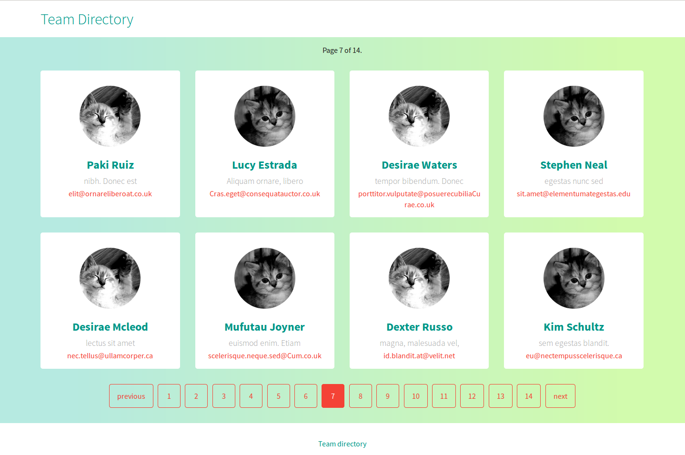

[](https://travis-ci.org/octopusinvitro/team-directory)
[](https://gitlab.com/octopusinvitro/team-directory/commits/master)


# Team directory



A project to play with Django pagination.

This app uses Python 3.4 and Django 1.10.3


## Install

Clone the repo and install all dependencies:

```bash
cd team-directory
pip install -r requirements.txt
```


## Run the migrations:

```bash
python3 manage.py makemigrations
python3 manage.py migrate
```


## Run the tests

```
python3 manage.py test
```


## Start the server:

```bash
python3 manage.py runserver
```

And go to <http://localhost:8000/>


# Random data

If you want to generate random data to fill the db:

* Go to <http://www.generatedata.com/>
* Fill in the four fields as name, title, email and image.
* For name, select a Data Type of names and in options write `FemaleName Surname|MaleName Surname`.
* For title, select "Fixed Number of Words" and Generate #3.
* For email, select "Email".
* For image, select "Constant", with Loop count: 1 and Values `https://placekitten.com/300/300|https://placekitten.com/200/200`.
* Down in "Export types" click on the SQL tab, "database table name" is `www_person`, "database type" is SQLite and unckeck all the checkboxes.
* Check the "New window/tab" radio button and click on Generate and copy all of it.
* Open a sqlite session with `sqlite3 db.sqlite3` and paste it in the prompt.

You should now have 100 new records. Enjoy!
